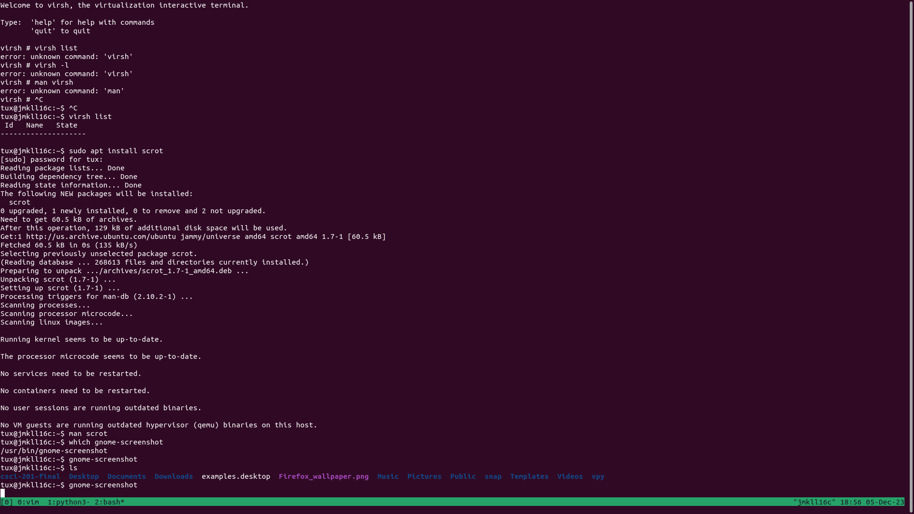

# CSCI-201 Final

## We are going to be building a Debian VM

### Step 1
First we need to create a new kvm vm of devian 12 on an Ubuntu 22.
- Install kvm and other dependencies
```bash
sudo apt install -y qemu-kvm libvirt-clients virt-manager
sudo apt install -y libvirt-daemon-system bridge-utils virtinst libvirt-daemon
sudo usermod -aG libvirt tux  
sudo usermod -aG libvirt-qemu tux
```
> Note that this should already be done on the system

